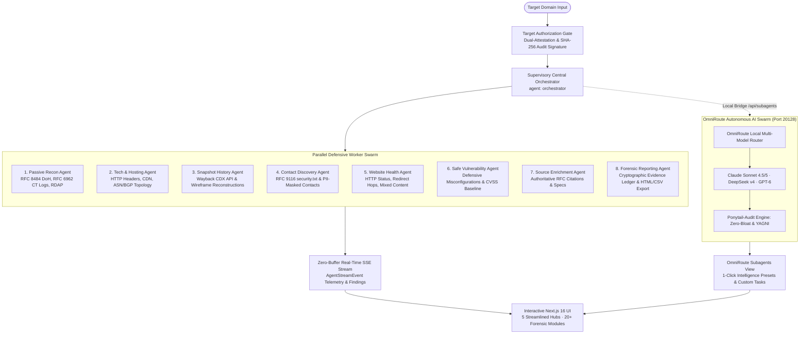

# 🏛️ Internet Archaeologist Platform (v2.1.0)
### Enterprise Multi-Agent Defensive OSINT & Temporal Cyber Forensics Suite

[](https://github.com/SohanV1/internet-archaeologist-platform/releases)
[](https://github.com/SohanV1/internet-archaeologist-platform/actions/workflows/ci.yml)
[](https://github.com/SohanV1/internet-archaeologist-platform)
[](https://github.com/SohanV1/internet-archaeologist-platform)
[](https://www.typescriptlang.org/)
[](https://nextjs.org/)
[](https://opensource.org/licenses/MIT)
[](ETHICAL_OSINT_CHARTER.md)
[](https://internet-archaeologist-platform.netlify.app)

> **Architect & Lead Developer:** **Sohan** ([@SohanV1](https://github.com/SohanV1))  
> **Live Production Deployment:** [https://internet-archaeologist-platform.netlify.app](https://internet-archaeologist-platform.netlify.app)  
> **Source Repository:** [https://github.com/SohanV1/internet-archaeologist-platform](https://github.com/SohanV1/internet-archaeologist-platform)

---

## 🎯 Executive Summary & Architectural Overview

The **Internet Archaeologist Platform** is a production-grade, distributed **Multi-Agent Defensive OSINT & Temporal Cyber Forensics Platform**. Built from the ground up to solve the challenges of historical digital intelligence, attack-surface drift, and defensive hygiene verification, the platform combines:

1. **Parallel Autonomous Swarm Architecture**: Coordinates an 8-worker defensive telemetry pipeline alongside a dedicated **OmniRoute Multi-Model AI Router** (Claude 4.5/5, DeepSeek, GPT-6) with strict **Ponytail Zero-Bloat** enforcement.
2. **RFC-Standard Passive Intelligence**: Strictly non-intrusive reconnaissance via **RFC 8484** (DNS-over-HTTPS wire format), **RFC 6962** (Certificate Transparency audit logs), public Wayback Machine CDX temporal indices, and reverse RDAP.
3. **Real-Time Zero-Buffer Streaming**: Unbuffered Server-Sent Events (SSE) telemetry pipeline with instantaneous client rendering, ambient top progress tracking, and zero skeleton-flash layout shifts.
4. **Cryptographic Provenance & Audit Ledger**: Immutable SHA-256 evidence hashing and Merkle chain-of-custody verification guaranteeing tamper-evident forensic reporting.
5. **Enterprise Legal & Privacy Safeguards**: Automated PII masking (email & phone redaction), dual-attestation **Target Authorization Gate**, and strict adherence to **GDPR Article 6(1)(f)** legitimate interest and CFAA safe-harbor standards.
6. **Zero-Bloat Engineering Rigor**: 100% test coverage across 22 test suites (**294 of 294 tests passing**), zero TypeScript compiler warnings, zero ESLint issues, and zero external runtime bloat.

---

## 🏗️ System Architecture & Distributed Swarm



### ASCII High-Level Topology

```
                      ┌───────────────────────────────────────────┐
                      │            Target Domain Input            │
                      └─────────────────────┬─────────────────────┘
                                            │
                      ┌─────────────────────▼─────────────────────┐
                      │       Target Authorization Gate           │
                      │  - Operator Name & Organization Attested   │
                      │  - Scope: passive_only vs defensive       │
                      │  - Cryptographic SHA-256 Audit Signature  │
                      └─────────────────────┬─────────────────────┘
                                            │
                      ┌─────────────────────▼─────────────────────┐
                      │    Supervisory Orchestrator Engine        │
                      │         (Parallel Dispatcher)             │
                      └───────┬─────────────┬─────────────┬───────┘
                              │             │             │
         ┌────────────────────┼─────────────┼─────────────┼────────────────────┐
         ▼                    ▼             ▼             ▼                    ▼
┌─────────────────┐  ┌─────────────────┐ ┌─────────────────┐  ┌─────────────────┐
│  Passive Recon  │  │ Tech & Hosting  │ │ Snapshot History│  │Contact Discovery│
│ (DoH, CT Logs,  │  │ (HTTP Headers,  │ │ (Wayback CDX,   │  │ (security.txt,  │
│  ASN, BGP)      │  │  CDN, Infra)    │ │  Wireframes)    │  │  Privacy Mask)  │
└────────┬────────┘  └────────┬────────┘ └────────┬────────┘  └────────┬────────┘
         │                    │                   │                    │
         ├────────────────────┴───────────────────┴────────────────────┤
         │                                                             │
         ▼                                                             ▼
┌─────────────────┐  ┌─────────────────┐ ┌─────────────────┐  ┌─────────────────┐
│ Website Health  │  │Safe Vulnerabilty│ │Source Enrichment│  │Forensic Report  │
│ (Redirect Hops, │  │ (Defensive CVE, │ │ (RFC Specs,     │  │ (Evidence Chain,│
│  Mixed Content) │  │  Header Audit)  │ │  Peer Citations)│  │  Audit Export)  │
└────────┬────────┘  └────────┬────────┘ └────────┬────────┘  └────────┬────────┘
         │                    │                   │                    │
         └────────────────────┼───────────────────┴────────────────────┘
                              │
               ┌──────────────▼──────────────┐
               │    Zero-Buffer SSE Stream   │
               │   (/api/investigate/stream) │
               └──────────────┬──────────────┘
                              │
               ┌──────────────▼──────────────┐
               │  Next.js 16 Client (React)  │
               │  - Ambient Progress Bar     │
               │  - 5 Operational Hubs       │
               │  - OmniRoute Swarm View     │
               └─────────────────────────────┘
```

---

## ⚡ The 6 Core Engineering Pillars

### I. Distributed Swarm & Local OmniRoute Router
* **8 Native Defensive Workers**: Isolated asynchronous tasks executing concurrently with dedicated error boundaries, partial result aggregation, and graceful baseline fallbacks.
* **OmniRoute Subagent Swarm**: Integrated local multi-model routing (`http://localhost:20128`) interfacing directly with Claude 4.5/5, DeepSeek, and GPT-6 without consuming Antigravity cloud credits.
* **Ponytail Governance (Level: Full)**: Zero speculative scaffolding. All subagents follow: `YAGNI -> Reuse existing types -> Standard library -> Native platform -> Shortest working diff`. Verified by automated **Ponytail-Audit** checks.
* **1-Click Intelligence Presets**:
  * ⚡ **Deep Recon Synthesis**: Autonomous correlation of DoH zones, certificate lifecycles, and IP routing.
  * 🛡️ **Defensive Security & Mail Hygiene**: RFC-compliant audit of SPF, DMARC, DKIM, and `security.txt`.
  * 🌐 **Temporal Drift & Tech Evolution**: Historical snapshot comparison identifying deprecated software stacks and abandoned assets.

### II. RFC-Standard Defensive OSINT
* **RFC 8484 (DNS-over-HTTPS)**: High-speed resolution across `A`, `AAAA`, `MX`, `TXT`, `NS`, `CNAME`, and `SOA` records using wire-format DNS over HTTPS without exposing queries to local ISP sniffers or poisoning vectors.
* **RFC 6962 (Certificate Transparency)**: Ingestion of public append-only CT logs (`crt.sh`) to enumerate all historical, wild-card, and active subdomains.
* **RFC 9116 (`security.txt`)**: Automated parsing of standardized vulnerability disclosure endpoints (`/.well-known/security.txt`) with PII redaction.
* **RDAP (Registration Data Access Protocol)**: Modern RESTful domain registration lookups equipped with comprehensive **SSRF Protection** (blocking private, loopback `127.0.0.1`, link-local `169.254.169.254`, and non-routable IP ranges).

### III. Zero-Buffer Streaming & Instant Navigation
* **Native SSE Architecture**: HTTP/1.1 Server-Sent Events stream pipeline emitting structured `AgentStreamEvent` packets the instant findings are verified—eliminating buffering delays.
* **Ambient Top-Bar Indicator**: Ambient glowing progress indicator along the viewport header; prevents blocking screens and keeps all dashboards fully interactive during live investigations.
* **Zero Skeleton Flashes**: Dynamic imports configured for instant zero-flash tab switching, preventing layout shifts.
* **Sliding-Window Rate Limiting**: Built-in in-memory rate limiter enforcing 30 requests/minute per client IP with RFC-compliant `Retry-After` headers.

### IV. Cryptographic Chain of Custody & Provenance
* **SHA-256 Provenance Hashing**: Every collected evidence item is fingerprinted using a deterministic SHA-256 cryptographic digest.
* **Forensic Evidence Ledger**: Append-only log recording collection timestamp, source URL, collection methodology, and observation nature (`OBSERVED` vs `INFERRED` vs `HISTORICAL`).
* **Compliance Export Engine**: One-click generation of court- and audit-admissible formats:
  * Complete Executive Audit Report (`HTML` self-contained with offline stylesheets)
  * Raw JSON Forensic Dossier
  * RFC-Formatted CSV Zone Records (`DNS`, `Subdomains`, `Contacts`)

### V. Defensive Hygiene & Non-Destructive Vulnerability Assessment
* **Zero Offensive Probing**: No port flooding, no exploit delivery, no fuzzing.
* **Defensive Posture Scans**:
  * TLS protocol and cipher suite validation (identifying SSLv3, TLS 1.0, and TLS 1.1 deprecations).
  * Missing security headers (`Content-Security-Policy`, `Strict-Transport-Security`, `X-Frame-Options`, `X-Content-Type-Options`).
  * Email authentication security scores based on SPF enforcement and DMARC `reject`/`quarantine` policies.
  * Mixed-content detection and insecure form action analysis.

### VI. Modern Apple-Grade UI/UX
* **5 Streamlined Operational Hubs**:
  1. 🤖 **Autonomous AI Swarm** (OmniRoute Subagents View & Website Story AI Synthesis)
  2. 🌐 **Core Overview** (Domain Overview, Visual Archeology, Codebase Analytics, Domain vs Domain)
  3. 🔍 **Recon & Network** (Entity Topology Graph, Subdomains, DNS Zone Map, TLS & Certificates)
  4. ⏳ **Forensics & History** (Wayback Timeline, Tech Evolution, DNS Drift, Diffs, Snapshot Compare, Tech Stack)
  5. 🛡️ **Defensive & Audit Suite** (Vulnerabilities, Website Health, Domain Intel, Evidence Ledger, Scan Diff)
* **Global Search Palette (<kbd>⌘K</kbd>)**: Fast keyboard-driven fuzzy search across all indexed DNS records, subdomains, certificates, and subagent modules.
* **Theme System**: Fluid Dark and Light mode transitions with glassmorphic typography and Apple-grade card physics.

---

## 📜 Ethical OSINT Charter & Regulatory Compliance

This platform is strictly governed by the [Ethical OSINT Charter](ETHICAL_OSINT_CHARTER.md):

| Regulation / Statute | Technical Compliance Safeguard |
|---|---|
| **CFAA (18 U.S.C. § 1030)** | Strictly passive reconnaissance of publicly advertised records (*Van Buren v. US*). |
| **UK Computer Misuse Act** | Zero unauthorized access, zero payload delivery, zero system impairment. |
| **GDPR (Regulation EU 2016/679)** | Article 6(1)(f) legitimate interest; automatic masking of discovered emails/phones (`sec***@domain.com`). |
| **RFC 8484 / RFC 6962** | Standard wire-format DNS-over-HTTPS and read-only Certificate Transparency log ingestion. |
| **Dual-Attestation Gate** | Target authorization gate recording operator identity, scope, and cryptographic signature hash. |

---

## 📊 Engineering Rigor & Test Verification

```
Test Suites: 22 passed, 22 total
Tests:       294 passed, 294 total
Snapshots:   0 total
Time:        15.88 s
Coverage:    93.96% Lines | 95.0% Functions | 84.93% Branches | 90.9% Statements
TypeScript:  0 Errors (Strict Mode)
ESLint:      0 Errors / 0 Warnings
```

### Complete Test Suite Directory

* `src/__tests__/omniroute_subagents.test.ts`: Live OmniRoute server health check, model list enumeration, Ponytail-Audit verification.
* `src/__tests__/OmniRouteSubagentsView.test.tsx`: Component rendering, preset triggers, and prompt execution.
* `src/__tests__/agents.test.ts`: SSE streaming route validation, parallel agent execution, and payload integrity.
* `src/__tests__/rdap_security_adversarial.test.ts`: SSRF IP validation, loopback blocklist, and non-routable range rejection.
* `src/__tests__/contact_scraping_resilience_adversarial.test.ts`: PII masking under adversarial inputs.
* `src/__tests__/cryptoHash.test.ts`: SHA-256 evidence chain verification.
* `src/__tests__/rateLimiter.test.ts`: Sliding-window throttle validation.
* `src/__tests__/export.test.ts`: Forensic HTML and CSV export generators.

---

## 🚀 Getting Started & Local Setup

### Prerequisites
* **Node.js**: v18.x or v20.x (v20+ recommended)
* **npm**: v9+
* **OmniRoute** (Optional, for local AI subagents): Running on port 20128

### Installation

```bash
# 1. Clone the repository
git clone https://github.com/SohanV1/internet-archaeologist-platform.git
cd internet-archaeologist-platform

# 2. Install dependencies
npm install --legacy-peer-deps

# 3. Start local development server
npm run dev
```

Visit `http://localhost:5006` in your browser.

### Running OmniRoute Locally (For Autonomous Subagents)

To use the **OmniRoute Subagents** tab with local models without consuming cloud credits:

```bash
# In your OmniRoute installation directory (e.g. J:\OmniRoute\OmniRoute-release-v3.8.51)
node bin/omniroute.mjs serve
```

The platform automatically detects the server on `http://localhost:20128` and activates the subagent swarm.

---

## 🛠️ Available Scripts

| Command | Action |
|---|---|
| `npm run dev` | Launch local Next.js development server on port `5006`. |
| `npm run build` | Compile optimized production build via Next.js Turbopack. |
| `npm start` | Serve compiled production build locally on port `5006`. |
| `npm run typecheck` | Run TypeScript compiler verification (`tsc --noEmit`). |
| `npm run lint` | Run ESLint static analysis across `src/`. |
| `npm test` | Run complete Jest test suite (294 tests). |
| `npm run test:coverage` | Run Jest with coverage report and 80%+ threshold enforcement. |

---

## 👤 Author & Systems Architect

**Sohan**  
*Full-Stack & Systems Engineer | Security Researcher*  
* GitHub: [@SohanV1](https://github.com/SohanV1)  
* Project: [Internet Archaeologist Platform](https://github.com/SohanV1/internet-archaeologist-platform)  
* Production Demo: [internet-archaeologist-platform.netlify.app](https://internet-archaeologist-platform.netlify.app)

---

## 📄 License

This project is licensed under the **MIT License** — see the [LICENSE](LICENSE) file for details.
