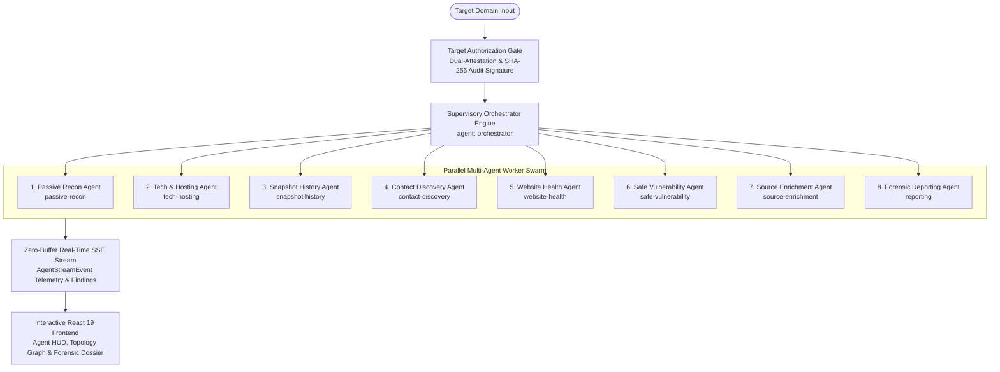

# 🏛️ Internet Archaeologist Platform (v2.0)

[](https://github.com/SohanV1/internet-archaeologist-platform/releases)
[](https://github.com/SohanV1/internet-archaeologist-platform/actions/workflows/ci.yml)
[](https://github.com/SohanV1/internet-archaeologist-platform/actions/workflows/release-v2.yml)
[](https://github.com/SohanV1/internet-archaeologist-platform/actions/workflows/test.yml)
[](https://github.com/SohanV1/internet-archaeologist-platform)
[](https://opensource.org/licenses/MIT)
[](https://nextjs.org/)
[](https://www.typescriptlang.org/)
[](https://tailwindcss.com/)
[](https://internet-archaeologist-platform.netlify.app)

**Internet Archaeologist Platform v2.0** is an enterprise-grade **Multi-Agent Defensive OSINT & Website Security Suite**. It combines autonomous parallel agent swarming, real-time Server-Sent Events (SSE) streaming, cryptographic chain of custody, and strictly non-destructive vulnerability assessment to deliver comprehensive security posture evaluation, historical temporal forensics, and infrastructure drift analysis.

🔗 **Live Deployment:** [https://internet-archaeologist-platform.netlify.app](https://internet-archaeologist-platform.netlify.app)  
📦 **GitHub Repository:** [https://github.com/SohanV1/internet-archaeologist-platform](https://github.com/SohanV1/internet-archaeologist-platform)

---

## 📑 Table of Contents
- [Multi-Agent Swarm Architecture](#-multi-agent-swarm-architecture)
- [The 8 Specialized Defensive Agents](#-the-8-specialized-defensive-agents)
- [Target Authorization Gate & Audit Trail](#-target-authorization-gate--audit-trail)
- [Safe Non-Destructive Assessment Methodology](#-safe-non-destructive-assessment-methodology)
- [Real-Time Streaming API & Protocol](#-real-time-streaming-api--protocol)
- [Version 2.0 Core Capabilities](#-version-20-core-capabilities)
- [Getting Started & Local Setup](#-getting-started--local-setup)
- [Available Scripts](#-available-scripts)
- [Testing & Quality Assurance](#-testing--quality-assurance)
- [Release Engineering & GitHub Release Instructions](#-release-engineering--github-release-instructions)
- [Contributing & License](#-contributing--license)

---

## 🏗️ Multi-Agent Swarm Architecture

The Version 2.0 engine coordinates 8 specialized defensive worker agents through a central supervisory orchestrator. The pipeline ingests the target domain through the **Target Authorization Gate**, verifies operator attestation, and fans out tasks across independent workers, streaming real-time telemetry back to the user via unbuffered SSE.



### ASCII Architecture Overview

```
                      ┌───────────────────────────────────────────┐
                      │            Target Domain Input            │
                      └─────────────────────┬─────────────────────┘
                                            │
                      ┌─────────────────────▼─────────────────────┐
                      │       Target Authorization Gate           │
                      │  - Operator Name & Organization Attested   │
                      │  - Scope: passive_only vs defensive       │
                      │  - Cryptographic SHA-256 Audit Signature  │
                      └─────────────────────┬─────────────────────┘
                                            │
                      ┌─────────────────────▼─────────────────────┐
                      │    Supervisory Orchestrator Engine        │
                      │         (Parallel Dispatcher)             │
                      └──────────────┬─────────────┬──────────────┘
                                     │             │
        ┌────────────────────────────┼─────────────┼────────────────────────────┐
        ▼                            ▼             ▼                            ▼
┌───────────────┐            ┌───────────────┐ ┌───────────────┐        ┌───────────────┐
│ Passive Recon │            │ Tech & Hosting│ │History/Visual │        │Contact Recon  │
│  (DNS, crt.sh,│            │(HTTP Headers, │ │ (Wayback CDX, │        │(security.txt, │
│  ASN, BGP)    │            │ CDN, Infra)   │ │  Wireframes)  │        │ Privacy Mask) │
└───────┬───────┘            └───────┬───────┘ └───────┬───────┘        └───────┬───────┘
        │                            │             │                            │
        ├────────────────────────────┴─────────────┴────────────────────────────┤
        │                                                                       │
        ▼                                                                       ▼
┌───────────────┐            ┌───────────────┐ ┌───────────────┐        ┌───────────────┐
│Website Health │            │Safe Vuln Audit│ │Source Enrich  │        │Forensic Report│
│ (Latency, TLS,│            │(OWASP / NIST, │ │(RDAP, M365/   │        │(Evidence Hash,│
│  Form Hygiene)│            │ CVSS Scored)  │ │ Google, DMARC)│        │ Graph, Diff)  │
└───────┬───────┘            └───────┬───────┘ └───────┬───────┘        └───────┬───────┘
        │                            │             │                            │
        └────────────────────────────┼─────────────┴────────────────────────────┘
                                     │
                      ┌──────────────▼────────────────────────────┐
                      │    Zero-Buffer SSE Event Dispatcher       │
                      │  - X-Accel-Buffering: no                  │
                      │  - Cache-Control: no-cache, no-transform  │
                      │  - Sub-millisecond Telemetry Delivery     │
                      └──────────────┬────────────────────────────┘
                                     │
                      ┌──────────────▼────────────────────────────┐
                      │      Interactive Forensic UI Dashboard    │
                      │  - Agent HUD & Live Swarm Telemetry       │
                      │  - Relationship Graph & Topology Map      │
                      │  - Historical Scan-to-Scan Delta Matrix   │
                      └───────────────────────────────────────────┘
```

---

## 🤖 The 8 Specialized Defensive Agents

Each agent in the swarm operates with isolated responsibilities, deterministic outputs, and standardized confidence scoring:

| # | Agent ID | Agent Name | Core Responsibilities | Standards & Data Sources |
| :-: | :--- | :--- | :--- | :--- |
| **0** | `orchestrator` | **Swarm Conductor** | Task scheduling, dependency sequencing, SSE stream multiplexing, and error isolation. | Internal Event Bus |
| **1** | `passive-recon` | **Passive Reconnaissance** | Authoritative DNS-over-HTTPS queries, zone records (A, AAAA, MX, TXT, NS, SOA), Certificate Transparency log mining, and ASN/BGP routing lookup. | RFC 8484 (DoH), Cloudflare DNS, crt.sh (RFC 6962), Team Cymru BGP |
| **2** | `tech-hosting` | **Tech & Hosting Profiler** | Response header dissection, CMS/framework fingerprinting, cloud host identification, CDN edge proxy detection, and container runtime heuristics. | HTTP/1.1 & HTTP/2 Headers, Wappalyzer Fingerprint Rules |
| **3** | `snapshot-history` | **Temporal Forensics** | Historical crawl indexing, tech stack migration eras (Genesis through Jamstack), and retro browser UI wireframe reconstruction. | Internet Archive CDX API, Wayback Machine |
| **4** | `contact-discovery` | **Contact & Identity Recon** | Discovers public administrative, security, and technical contacts with automated role categorization and PII privacy masking. | RFC 9116 (`security.txt`), RDAP Contacts, HTML metadata |
| **5** | `website-health` | **Website Health & Hygiene** | Measures HTTP latency, availability, redirect hops, broken links, mixed-content occurrences, and login form hygiene. | Synthetic HTTP Probes, W3C Standards |
| **6** | `safe-vulnerability` | **Defensive Vulnerability Audit** | Strictly non-destructive security assessment, missing security headers, TLS posture, email spoofability, and CVSS v3.1 scoring. | OWASP Top 10, NIST SP 800-115, CISA Advisories |
| **7** | `source-enrichment` | **Source & Mail Enrichment** | Queries modern RDAP endpoints for lifecycle dates and detects enterprise email providers (Google Workspace, M365, Zoho) with SPF/DMARC analysis. | RFC 7480-7484 (RDAP), RFC 7208 (SPF), RFC 7489 (DMARC) |
| **8** | `reporting` | **Forensic Evidence Engine** | Compiles verifiable evidence items, computes SHA-256 chain-of-custody hashes, constructs topology graphs, and generates scan diffs. | Web Crypto API (SHA-256), D3 Graph Engine |

---

## 🛡️ Target Authorization Gate & Audit Trail

The platform enforces a mandatory **Target Authorization Gate** prior to launching active or defensive probes. This ensures strict legal, ethical, and organizational compliance.

### Pre-Flight Attestation Parameters
- **Operator Identity:** Captures the analyst's verified handle and organization name.
- **Scope Selection:**
  - `passive_only`: 100% passive OSINT. Queries only public resolvers (DoH, crt.sh, RDAP, Wayback). Zero direct packets sent to target infrastructure.
  - `authorized_defensive`: Enables safe, non-intrusive health, TLS, and header checks against target web endpoints.
- **Certified Ownership:** Requires explicit attestation that the operator owns the target or holds written authorization.
- **Non-Destructive Pledge:** Enforces a binding confirmation that no intrusive, destructive, or denial-of-service tests will be initiated.

### Cryptographic Audit Signature
Every authorization creates an immutable audit record signed using the Web Crypto API:
```typescript
const signatureContent = `${targetDomain}:${scope}:${operatorName}:${organization}:${timestamp}`;
const auditSignatureHash = await crypto.subtle.digest('SHA-256', new TextEncoder().encode(signatureContent));
```

The resulting `auditSignatureHash` is bound to the investigation payload and persisted in the audit ledger, capturing transitions across `SCAN_INITIATED`, `AUTH_GRANTED`, `AGENT_STARTED`, `AGENT_COMPLETED`, and `REPORT_EXPORTED`.

---

## 🔒 Safe Non-Destructive Assessment Methodology

The Internet Archaeologist Platform strictly rejects aggressive or harmful penetration testing techniques. Its vulnerability assessment engine adheres to **NIST SP 800-115** (*Technical Guide to Information Security Testing and Assessment*) and **OWASP Defensive Verification Standards**:

### Explicitly Prohibited Actions
❌ **Zero Exploitation Payloads:** No SQL injection, command execution, or XSS execution vectors.  
❌ **Zero Credential Spraying:** No password brute-forcing, dictionary attacks, or credential guessing.  
❌ **Zero Fake Form Submissions:** No automated submission of production forms or registration fields.  
❌ **Zero Denial-of-Service (DoS):** Rate-limited probes with exponential backoff and jitter; no packet flood attacks.  

### Authorized Defensive Inquiries
✅ **Transport Security:** Verifies TLS certificate expiry, subject alternative names (SANs), and strict transport directives (HSTS).  
✅ **HTTP Security Headers:** Inspects headers for `Content-Security-Policy`, `X-Frame-Options`, `X-Content-Type-Options`, and `Referrer-Policy`.  
✅ **Email Spoofing Resilience:** Parses SPF policies (`-all` vs `~all`) and validates DMARC reject policies against domain impersonation.  
✅ **Login Form Hygiene:** Confirms HTTPS action attributes, flags cleartext credential risks, and evaluates CSRF token presence.  
✅ **RFC 9116 Verification:** Checks for standard `/.well-known/security.txt` files for vulnerability disclosure coordination.

---

## ⚡ Real-Time Streaming API & Protocol

The backend streams real-time swarm updates using standard **Server-Sent Events (SSE)**, enabling the frontend to display live agent telemetry without artificial buffering or polling delays.

### API Endpoint: `POST /api/investigate`

#### Request Payload
```json
{
  "domain": "example.com",
  "options": {
    "includeVisuals": true,
    "includeSubdomains": true,
    "depth": "full"
  }
}
```

#### SSE Headers (Zero-Buffering Configuration)
```http
Content-Type: text/event-stream
Cache-Control: no-cache, no-transform
Connection: keep-alive
X-Accel-Buffering: no
Transfer-Encoding: chunked
```

#### Event Envelope (`AgentStreamEvent`)
```json
{
  "type": "telemetry",
  "agentId": "safe-vulnerability",
  "timestamp": "2026-09-24T19:30:00.000Z",
  "payload": {
    "telemetry": {
      "id": "safe-vulnerability",
      "name": "Defensive Vulnerability Audit",
      "role": "Security Hygiene & OWASP Profiler",
      "status": "running",
      "progress": 65,
      "currentAction": "Evaluating HSTS and CSP directive enforcement",
      "findingsCount": 3
    }
  }
}
```

#### Supported Event Types
- `telemetry`: Real-time percentage progress, active micro-action, and status transitions per agent.
- `finding`: Incremental finding notifications (e.g., detected subdomains, DNS drift events, or missing security headers).
- `audit`: Immutable audit ledger events recording authorization and lifecycle timestamps.
- `complete`: Final synthesized investigation payload containing all cross-linked evidence items and topological graphs.
- `error`: Error envelope with non-fatal degradation notices or fatal domain resolution exceptions.

---

## 🌟 Version 2.0 Core Capabilities

### 1. RDAP & Modern WHOIS Intelligence
- Direct HTTPS queries to regional internet registries (ARIN, RIPE, APNIC, LACNIC, AFRINIC) via RFC 7480–7484.
- Automated parsing of domain registration, expiration countdown, registrar details, and privacy protection status.
- Authoritative abuse escalation contacts (email and telephone).

### 2. Enterprise Email Provider Detection & Security Posture
- High-accuracy detection of business mail ecosystems: **Google Workspace**, **Microsoft 365**, **Zoho Mail**, **ProtonMail**, **iCloud Mail**, and **Fastmail**.
- Comprehensive SPF validation: classifies fail policies (Strict `-all`, SoftFail `~all`, Neutral `?all`, Permissive `+all`, Missing).
- DMARC posture scoring: verifies policy (`reject`, `quarantine`, `none`), alignment modes, and reporting mailboxes.

### 3. Role-Categorized Privacy-Masked Contacts
- Discovers email and phone contacts from security policies (`security.txt`), RDAP abuse records, and HTML metadata.
- Categorizes contacts into 5 roles: *Security / CERT*, *Abuse / Legal*, *Technical / Webmaster*, *Support / Sales*, and *General*.
- Enforces strict regex-based privacy masking (`sec***@example.com`) to protect personal identifiable information (PII).

### 4. Website Health & Login Form Hygiene
- Measures latency, HTTP response status, redirect chains, and mixed-content risks.
- Analyzes login forms for secure submission targets (`https://`), CSRF protection tokens, password field attributes, and cleartext risks.

### 5. Historical Scan-to-Scan Diffing Engine
- Compares current scans against previous investigations for the same domain.
- Automatically calculates surface drift: newly discovered subdomains, decommissioned hosts, resolved vulnerabilities, and newly introduced risks.
- Provides net score delta indicators (`netScoreDelta`) and executive remediation progress narratives.

### 6. Visual Archeology & Interface Slider Diff
- Interactive split-screen slider comparing temporal webpage captures side-by-side across decades.
- Faithful wireframe mockups reproducing vintage table-based HTML4, Web 2.0 skeuomorphism, responsive flat layouts, and modern dark glassmorphism.
- Authentic retro browser chrome viewports (Windows 98 IE, Windows 7 Chrome, Modern Dark).

### 7. Codebase Intelligence & D3.js Analytics
- Interactive D3.js nested hierarchical Treemap of directory and module distribution.
- Language composition doughnut chart and lines-of-code comparisons across projects.
- Runtime budget breakdown: Executable (46%) | Documentation (41%) | Config (14%).
- 1-click high-resolution PNG and SVG chart exporting.

---

## 🚀 Getting Started & Local Setup

### Prerequisites
- **Node.js**: `v20.x` or higher (tested on Node 20.x & 22.x LTS)
- **npm**: `v9.x` or higher

### Installation & Quick Start
```bash
# 1. Clone the repository
git clone https://github.com/SohanV1/internet-archaeologist-platform.git
cd internet-archaeologist-platform

# 2. Install dependencies (using legacy peer deps for modern React 19 compatibility)
npm install --legacy-peer-deps

# 3. Start local development server with Turbopack on port 5006
npm run dev

# 4. Open in browser
open http://localhost:5006
```

---

## 📜 Available Scripts

| Script | Command | Purpose |
| :--- | :--- | :--- |
| **`npm run dev`** | `next dev -p 5006` | Launches local development server with Next.js Turbopack |
| **`npm run build`** | `next build` | Compiles optimized Next.js production build bundle |
| **`npm run start`** | `next start -p 5006` | Boots the compiled production server |
| **`npm run typecheck`** | `tsc --noEmit` | Executes full TypeScript type verification |
| **`npm run lint`** | `eslint src/` | Analyzes code quality and style compliance via ESLint |
| **`npm run format`** | `prettier --write src/` | Formats all source files using Prettier |
| **`npm test`** | `jest` | Executes Jest unit and component test suites |
| **`npm run test:coverage`** | `jest --coverage` | Runs unit tests enforcing strict **≥80% coverage threshold** |

---

## 🧪 Testing & Quality Assurance

The codebase enforces strict quality gates through automated tests covering cryptographic hashing, resilient fetch handlers, domain sanitization, error boundaries, and snapshot generation:

```bash
# Run unit tests with Istanbul coverage enforcement
npm run test:coverage
```

### Coverage Thresholds (Strictly Enforced in CI)
- **Statements:** ≥ 80%
- **Branches:** ≥ 80%
- **Functions:** ≥ 80%
- **Lines:** ≥ 80%

---

## 📦 Release Engineering & GitHub Release Instructions

The repository uses automated GitHub Actions workflows to validate, test, package, and publish releases.

### Workflow: `.github/workflows/release-v2.yml`
- **Trigger:** Push of semver tags matching `v*` (e.g., `v2.0.0`) or manual execution via `workflow_dispatch`.
- **Stage 1 (`validate-and-test`):** Checks out code, sets up Node 20 with npm caching, runs `typecheck`, `lint`, and `test:coverage` (≥80% threshold).
- **Stage 2 (`create-release`):** 
  - Builds the production bundle.
  - Dynamically parses and extracts version release notes from `CHANGELOG.md`.
  - Packages source and distribution archives (`internet-archaeologist-v2.0.0.tar.gz` and `.zip`).
  - Publishes official release to GitHub via `softprops/action-gh-release@v2`.

### Step-by-Step: Publishing a New Release

```bash
# 1. Ensure working directory is clean and on main
git checkout main
git pull origin main

# 2. Run local validation gates
npm run typecheck
npm run lint
npm run test:coverage
npm run build

# 3. Create an annotated git tag
git tag -a v2.0.0 -m "Release v2.0.0 - Multi-Agent Defensive OSINT & Website Security Suite"

# 4. Push the tag to GitHub to trigger automated release
git push origin v2.0.0
```

Once pushed, track the release pipeline under the **Actions** tab on GitHub. The workflow will automatically publish the release, attach release notes, and upload the distribution tarball and zip archives.

---

## 🤝 Contributing & License

Contributions, security enhancements, and feature suggestions are welcome! Please read our [CONTRIBUTING.md](CONTRIBUTING.md) before submitting pull requests.

### License
Distributed under the **MIT License**. See [LICENSE](LICENSE) for full details.

---

🏛️ **Internet Archaeologist Platform** — Developed with passion by [Sohan V](https://github.com/SohanV1).
